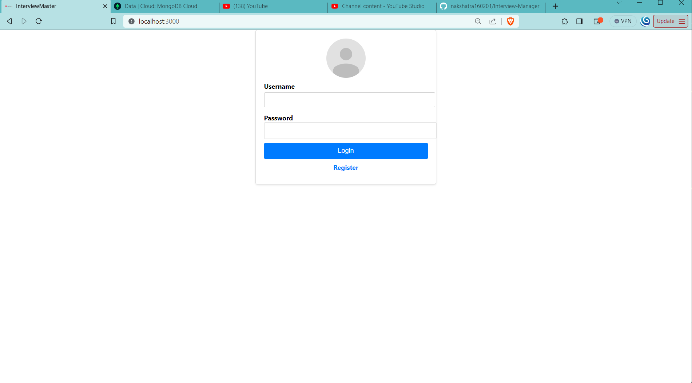
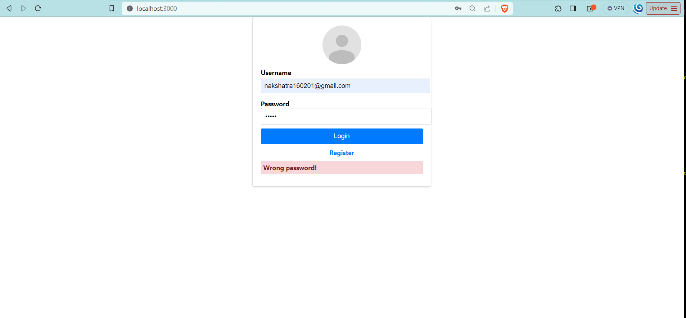
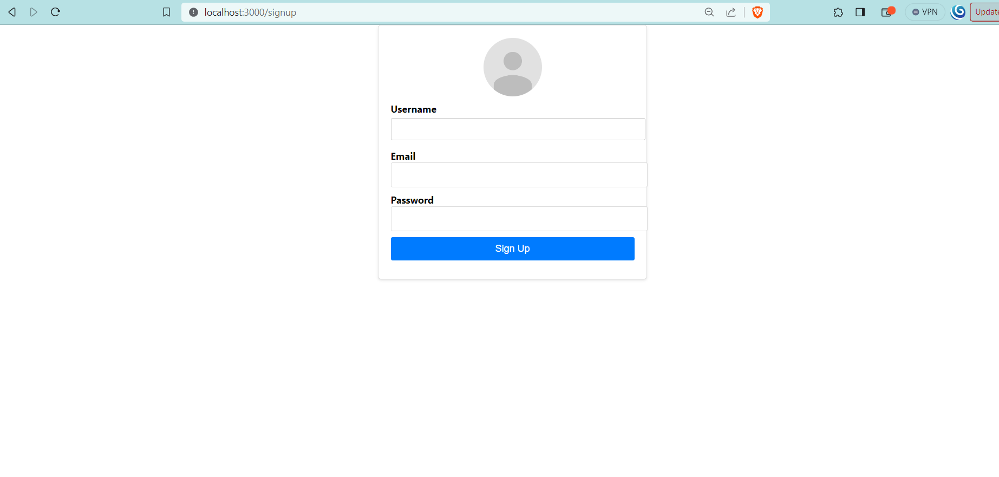
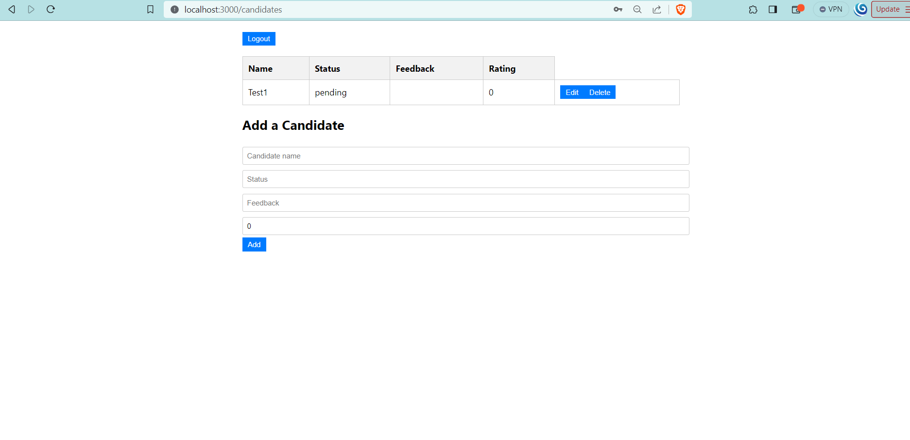

# Interview Manager

Interview Manager is a web application for managing interview candidates and conducting interviews efficiently. It provides an intuitive interface for interviewers to manage and track candidates' details, feedback, and status.

## Table of Contents
- [Getting Started](#getting-started)
- [Frontend](#frontend)
- [Backend](#backend)
- [Models](#models)
- [Controllers](#controllers)
- [Routes](#routes)
- [Screenshots](#screenshots)
- [Live Demo](#live-demo)

## Getting Started

To get started with Interview Manager, you need to set up both the frontend and backend components.

### Frontend

The frontend of Interview Manager is built using React and TypeScript. To start the frontend application, follow these steps:

1. Install dependencies:

    ```bash
    npm install
    ```

2. Start the development server:

    ```bash
    npm start
    ```

The frontend will be available at [http://localhost:3000/](http://localhost:3000/). Make sure to start the backend server as mentioned below.

The frontend has the following routes:
- `/`: Login page
- `/signup`: Registration page
- `/candidates`: Displays the candidates being managed by the logged-in interviewer

On the `/candidates` page, you can:
- Add a new candidate
- Edit existing candidate details
- Delete a candidate

Authentication and Candidate services have been created to communicate with the backend from within the components. JWT tokens are used for authentication.

### Backend

The backend of Interview Manager uses a MongoDB database and a Node.js/Express server. To start the backend application, follow these steps:

1. Navigate to the `backend` directory:

    ```bash
    cd backend
    ```

2. Install backend dependencies:

    ```bash
    npm install
    ```

3. Start the server in development mode:

    ```bash
    npm run start:dev
    ```

The server will run on port 8080, and the frontend will be able to communicate with the backend.

## Models

The backend uses the following Mongoose schemas for modeling the data:

### User Schema
- `email`: The email of the user (interviewer)
- `password`: The hashed password of the user
- `name`: The name of the user
- `candidates`: An array of candidate references managed by the user

### Candidate Schema
- `name`: The name of the candidate
- `status`: The interview status of the candidate
- `feedback`: Feedback about the candidate
- `rating`: A rating for the candidate
- `interviewer`: A reference to the User who manages the candidate

## Controllers

The backend controllers handle user authentication and candidate management:

### User Authentication
- `signup`: Register a new user (interviewer)
- `login`: Authenticate and log in a user

### Candidate Management
- `getCandidates`: Retrieve candidates managed by the logged-in user
- `createCandidate`: Create a new candidate
- `updateCandidate`: Update an existing candidate's details
- `deleteCandidate`: Delete a candidate

## Routes

The API routes for the backend are defined in the `/routes` directory. They handle requests related to user authentication and candidate management. JWT tokens are used for user authentication.

## Screenshots







## Live Demo

[Watch the Live Demo on YouTube](https://youtu.be/usbLSHQ8DlI)

Unfortunately, due to limitations with deploying on Heroku, I was unable to provide a live deployment. Instead, I recorded a video to give you a first-hand experience of Interview Manager.

